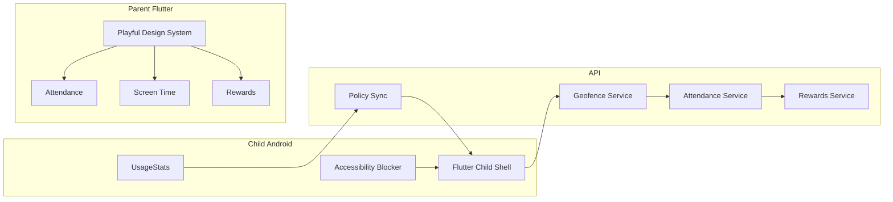

# Premium UX + Attendance, Rewards, Screen Time

**Overview:** Redesign PulangAman dengan visual playful-family premium, lalu tambah tiga diferensiator: auto school attendance, reward/streak anak, dan screen time Android (UsageStats + Accessibility) dengan emergency allowlist agar panic tetap selalu bisa.

## Decisions locked in

- Scope: UI premium + fitur unggulan (bukan UI saja)
- Visual: playful family (warna cerah, ilustrasi ringan, gamifikasi terlihat)
- Screen time Android: UsageStats + Accessibility blocking, parent PIN, emergency allowlist
- Phase 4 tetap deferred (BLE, stealth panic, WebRTC, ML, stranger dispatch)

## Current baseline

- Mobile: role switch di [`apps/mobile/lib/app.dart`](../apps/mobile/lib/app.dart), parent 5-tab shell, tema minimal di [`apps/mobile/lib/core/theme.dart`](../apps/mobile/lib/core/theme.dart), `go_router` belum dipakai
- Backend: geofence + FCM sudah ada; school “attendance” hanya heuristic 30 menit di [`services/api/src/routes/schools.ts`](../services/api/src/routes/schools.ts); `commute_status` selalu di-set `commuting` di [`services/api/src/routes/location.ts`](../services/api/src/routes/location.ts)
- Belum ada schema/API untuk policy, telemetry, attendance ledger, rewards

## Workstream order

1. Design system + navigation (fondasi semua layar)
2. Auto attendance (reuse geofence tertinggi)
3. Rewards/streaks (hook ke attendance)
4. Screen time Android (native heaviest + Play policy risk)

---

## 1) Playful-family premium UI/UX

**Design tokens & kit**

- Perluas [`apps/mobile/lib/core/theme.dart`](../apps/mobile/lib/core/theme.dart): palette cerah (coral/amber/sky + teal safety), spacing, radius, elevation, success/warn
- Tambah `lib/core/theme/app_typography.dart`, `app_spacing.dart`, `app_motion.dart`
- Tambah `lib/core/widgets/`: `PaButton`, `PaCard`, `PaEmptyState`, `PaChildAvatar`, `PaStatusBanner`, `PaPanicButton`, `PaProgressRing`, `PaRewardBadge`
- Pakai `go_router` (sudah di pubspec) lewat `lib/core/router/app_router.dart`
- Assets ringan: ilustrasi onboarding/empty state (tanpa clutter di panic)

**Role shells**

- Parent tabs jadi: **Anak | Sekolah | Layar | Hadiah | Lainnya** (Zona/Wali/Lapor/Rute di overflow)
- Child shell: panic tetap hero; di bawahnya kartu attendance hari ini + streak/points + status screen time
- Guardian shell: tetap safety-first, styling playful tapi guidance “jangan kejar orang asing” tetap jelas
- Login: onboarding singkat 2–3 slide playful sebelum form

**Hard UX rule:** panic button tidak boleh terkubur, tidak boleh di-block oleh screen time, tidak boleh tergantung reward.

---

## 2) Auto school attendance

**Backend**

- Migration baru: `attendance_events` (`check_in` / `check_out`, source `geofence|manual`, `school_id`, `client_event_id`, idempotent per hari)
- Service `src/services/attendance.ts`: tulis event dari geofence enter/exit zona `school` atau `schools.center` untuk anak di roster
- Perbaiki [`location.ts`](../services/api/src/routes/location.ts): jangan selalu `commuting`; set `home|school|commuting` dari presence
- Extend [`geofence.ts`](../services/api/src/services/geofence.ts): setelah zone event, panggil attendance + FCM `attendance_event` + WS `parent:attendance`
- Routes: `GET /api/v1/attendance?childId=&date=`, `GET /api/v1/schools/:id/attendance?date=`, optional parent manual correct
- Shared auth helper `src/middleware/roles.ts` (`assertParentOfChild`, `requireRoles`)

**Mobile**

- `features/attendance/`: parent day timeline + status chip di child card; child “Sudah di sekolah” calm card
- Live map handle `parent:zone_event` / attendance banner
- Zone create UX: map picker, bukan dialog lat/lng mentah

---

## 3) Rewards & streaks

**Backend**

- Tables: `reward_balances`, `reward_ledger` (append-only), optional parent `reward_rules`
- Service `src/services/rewards.ts`: award idempotent untuk `arrival_school`; streak timezone `Asia/Jakarta`
- Routes: `GET /rewards/:childId`, `GET /rewards/:childId/ledger`, `POST /rewards/:childId/adjust` (parent only)
- Jangan gamify panic suppression; jangan kirim koordinat di reward payload

**Mobile**

- Child: progress ring, streak flame, soft celebration
- Parent: weekly summary + manual bonus/penalty ringan
- Trigger utama: check-in sekolah; opsional nanti: patuhi budget screen time

---

## 4) Android screen time (UsageStats + Accessibility)

**Native Android** (greenfield di `apps/mobile/android/.../screentime/`)

- `UsageStatsBridge.kt` + `PACKAGE_USAGE_STATS`
- `AppBlockAccessibilityService.kt` untuk soft-block overlay
- `ScreenTimeForegroundService.kt` + persistent notification
- MethodChannel dari `MainActivity.kt`
- Manifest: usage access, accessibility service, FGS, boot receiver
- Emergency allowlist wajib: PulangAman sendiri, Phone, Messages, emergency dial; parent PIN untuk unlock sementara

**API**

- Tables: `child_devices`, `device_policies` (versioned JSON rules/schedules), `device_policy_acks`, `usage_telemetry` (+ unique `client_event_id`)
- Routes: parent CRUD/publish policy; child `GET current` + `POST ack`; `POST /telemetry/batch`
- FCM data-only `policy_sync`; kill switch `KILL_SWITCH_POLICY_ENFORCE`
- Retention short untuk telemetry (7–30 hari) + purge job pola [`purgeLocations.ts`](../services/api/src/jobs/purgeLocations.ts)

**Mobile Flutter**

- Parent: daftar app, daily limit, school-hours lockdown, PIN setup, permission onboarding (Usage Access + Accessibility)
- Child: status chip non-blocking; blocked-app overlay native, bukan Flutter route yang bisa di-bypass
- Offline: cache policy lokal; telemetry queue mirip [`offline_queue.dart`](../apps/mobile/lib/core/storage/offline_queue.dart)

**Play/policy risks to document in UI + README**

- Accessibility dipakai hanya untuk parental blocking, bukan remote control
- OEM (Xiaomi/Oppo) sering butuh langkah izin ekstra
- iOS Family Controls tidak masuk scope ini

---

## 5) Docs, tests, ship

- Update [`docs/planpulangaman.md`](planpulangaman.md) + [`README.md`](../README.md): Phase 3.5 differentiators, Android-only screen time, retention matrix
- Tests: streak/attendance/policy versioning unit tests; Flutter widget/golden untuk login, panic, reward card; Android instrumented smoke untuk UsageStats channel
- Push langsung ke `main` bila diminta saat implementasi (default: commit ke `main` setelah verifikasi lokal)

## Out of scope

- iOS screen time / FamilyControls
- Device Owner/MDM full lockdown
- Phase 4 deferred items
- Mengubah model trust guardian menjadi stranger marketplace

## Implementation todos

1. Playful design system, shared widgets, go_router role shells, onboarding
2. Attendance ledger + geofence hooks + parent/child attendance UX
3. Reward balances/ledger/streaks hooked to school check-in
4. Android UsageStats + Accessibility blocking, policy sync, telemetry, parent/child UI
5. Docs, tests, and ship verified changes
